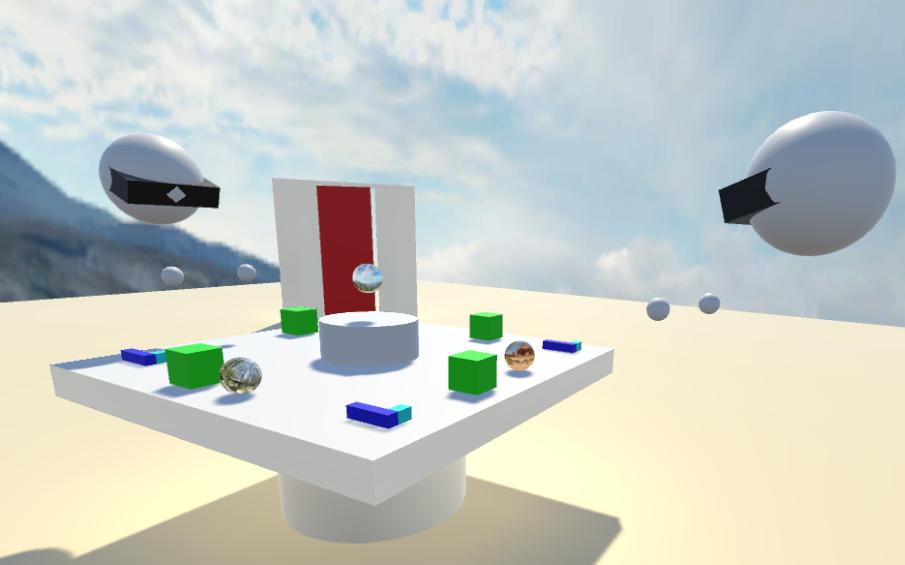
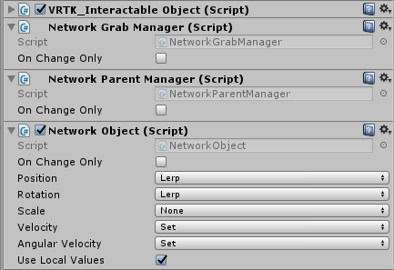
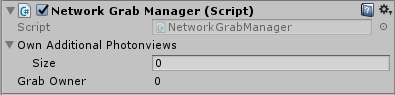
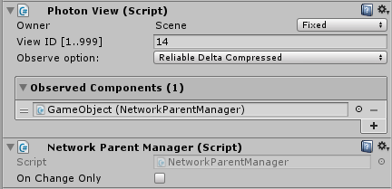
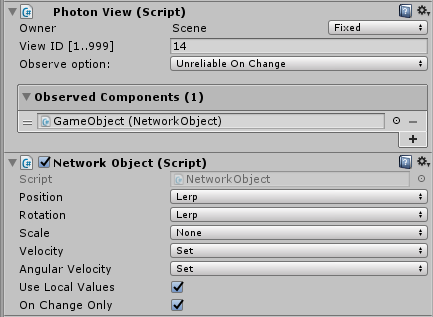

# PlayoVR, a VRTK-PUN-Voice Demo

A small Unity demo project using VRTK for object interaction and VR controller handling,
PhotonNetwork for allowing up to 4 people to join the same scene together and PUNVoice
so those people can actually talk to each other.

## Changelog

 - 2017-09-06
   - Fixed creation of duplicate remote players
 - 2017-05-11
   - Updated to latest version of VRTK
   - Updated to latest version of the Oculus Ultilities and Avatar (1.14.0)
 - 2017-05-09
   - Choose a less infamous name
 - 2017-05-05
   - Gave the project a proper name
 - 2017-05-04
   - Added a door to the scene
   - Fixed lighting problems with sky dome
 - 2017-05-03
   - Added a "sky dome" for 360 panoramic photos
   - The spheres are now containers for 360 panoramic photos
   - Bringing a photo sphere close to your head shows a personal preview
   - Placing a photo sphere on the central pedestal causes the sky dome to change for
   all connected players
 - 2017-04-25
   - Added `NetworkSnapManager` script for syncing snap actions over the network
   - The network scripts now have custom editors that show their current state which
     makes debugging much easier
   - The gun now animates (thanks jimthegrim)
 - 2017-03-23
   - Simplified project by removing DFVoice support and voice cli arguments
 - 2017-03-22
   - Added support for Photon Voice chat
 - 2017-03-20
   - Changed `NetworkParentableObject` to stand-alone `NetworkParentManager
   - Introduced `NetworkBehaviour` base class for all network classes
   - Made `onChangeOnly` part of all network classes and made it default to `false`
 - 2017-03-19
   - Now supporting objects that are re-parented
 - 2017-03-17
   - Fixed `SDKChooser`
   - Split the code up in modules
   - Code can now work without DFVoice
 - 2017-03-16
   - Updated to use the `SDKChooser`
 - 2017-03-15
   - First version
   
## Configuration

To be able to use this example project you'll have to set it up first:

 1. Open the project in Unity.
 2. In the menu bar click on `Window > Photon Unity Networking > Highlight Server Settings`.
 3. In the `Inspector` window change the `AppId` field to your own one [you got from Photon](https://www.photonengine.com/en-US/Dashboard).
 4. Open the `Main` scene found in the `Scenes` folder in the `Project` window.
 5. Hit `Play`!
 
## Testing locally

To test locally without another computer you can create a standalone Non-VR build:

 1. In the menu bar click on `File > Build Settings...`
 2. Click the `Build` button, choose a destination folder and name your executable.
 3. In the Explorer window that popped up right-click on the `.exe` and select `Create shortcut`
 4. Right-click on the newly created shortcut and select `Properties`
 5. In the `Target` field at the very end just after `.exe` type a space and `-novr`
 6. Click `Ok`
 7. Run the executable by double-clicking the shortcut
 8. Hit `Play` in the Unity Editor (or run the `.exe` instead of the shortcut)

## Command line arguments

 - `-vrmode` : force the program to use the specified SDK. Valid values for `<NAME>` are:
    - `openvr` (for SteamVR)
    - `oculus`
    - `none` (no VR support, will output to the monitor and use mouse and keyboard)

## Using networked interactable objects

If you want to add networking to your VRTK interactable objects then you just need to follow a couple of simple steps. This assumes you already have a project that has both the `VRTK` and `Photon Unity Networking` assets (you can find them on the Unity Asset store) and that networking has already been set up. So for each object that has a `VRTK_Interactable_Object` script you do the following:

 - From this project copy/drag the `NetBase` and `NetVRTK` folders
 - Add a `PhotonView` script
 - Add a `NetworkGrabManager` script
 - Add a `NetworkParentManager` script (when using `ChildOfController` mechanics)
 - Add a `NetworkObject` script (leave the default options)
 - Drag these last two scripts to the `Observed Components` of the `PhotonView`

## NetworkGrabManager

This script handles the transfer of "ownership" that Photon imposes on object. Only an object's owner is allowed to send updates about it, other can only receive updates. So to be able to pick up an object and move it we must first tell Photon that we want ownership of the object. The `NetworkGrabManager` does this for us.

### Properties:

 - **On change only** : By default this setting is enabled which means that values will only be sent to the other clients when they have actually changed. When disabled updates will always be sent on each network "tick".
 - **Own Additional Photonviews** : This can contain a list of additional `PhotonView` scripts that should change ownership when the player grabs the current object. This is useful for complex objects like for instance a door where the user might grab a door knob but the script for syncing the movement of the door is on the door, not the knob.

### Requirements/suggestions:

 - must be registered with a `PhotonView`'s list of `Observed Components`
 - best used with `PhotonView`'s `Reliable Delta Compressed` option and in that case leave `onChangeOnly` turned off
 - an `VRTK_InteractableObject` must exist on the same object

## NetworkSnapManager

This script syncs the action of an object being snapped to a drop zone across the network. If you don't use this script it might *seem* that everything works fine but a) the VRTK on remote clients doesn't really know the object is being snapped and b) the moment the client that performed the snap disconnects the "illusion" disappears.

### Properties:

 - **On change only** : By default this setting is enabled which means that values will only be sent to the other clients when they have actually changed. When disabled updates will always be sent on each network "tick".

### Requirements/suggestions:

 - must be registered with a `PhotonView`'s list of `Observed Components`
 - best used with `PhotonView`'s `Reliable Delta Compressed` option and in that case leave `onChangeOnly` turned off
 - an `VRTK_InteractableObject` must exist on the same object

## NetworkParentManager

This script handles those situations when an object changes parents.

There are several strategies that this script uses to determine if the object has changed parent and how it should communicate those changes to the other clients.

The easiest way is to look at the "full path" of its parent, eg: `/Building/Floor3/BookCase12/SnapZone`. If that changes we know the object has changed parents and we should tell the other clients about it. This works in some cases but besides being very inefficient (the string might be very long) it doesn't work when the object don't have the exact same "path name" in every client (eg. my plaey object is called "Player" locally but "Player(Clone)" in other clients).

So to make the process less dependent on the full path name because that not always uniquely references an object on all clients the `NetworkParentableObject` will look for the existence of a `PhotonView` component in any of the parents. It will then determine the path relative to that object. The advantage of that is a) all `PhotonView`s have a unique number that is the same across all clients en b) the paths to send will be shorter (many times the `PhotonView` can be found on the direct parent of the object which means we don't need a path at all) making things more efficient.

But unfortunately this doesn't cover one of the most common situations when using VRTK: grabbing an object using the `VRTK_Interactable_Object` grab mechanic. Because what happens when you grab an object is that VRTK will make it a child of the VR controller that performed the grab, it will *not* be a child of your player avatar's hands, which is the representation that others will see of you in _their_ clients. So we need a way to link your VR hands to the hands of your avatar in such a way that we can send the reparenting operation and in such a way that the other clients will understand it.

One way of solving this could be to actually move the `PhotonView`s from the hand of your local avatar to the VR controller objects. But the solution I've implemented in this demo is to create an object called `PhotonViewLink` which you can put on an object and then link it to a `PhotonView` on another object. When the `NetworkParentableObject` script encounters this it will treat the linked `PhotonView` as the object's parent.

And finally we have the situation where a parent object is part of the scene, it won't get moved around so it doesn't need a `PhotonView` (and you don't want to give it one either because you can only have a 1000 tracked objects in Photon in total) but its "full path" can't always be determined 100%. For those cases exists the `NetworkAttachment` script. It serves the same function as a `PhotonView` for determining parentage but without actually wasting the resources of an actual `PhotonView`.

### Properties:

 - **On change only** : By default this setting is enabled which means that values will only be sent to the other clients when they have actually changed. When disabled updates will always be sent on each network "tick".

### Requirements/suggestions:

 - must be registered with a `PhotonView`'s list of `Observed Components`
 - best used with `PhotonView`'s `Reliable Delta Compressed` option and in that case leave `onChangeOnly` turned off
 - the `PhotonView` must be owned by the player manipulating the object, see `NetworkGrabManager` if you want to handle that dynamically
 - If used with a `NetworkGrabManager` place this script *after* that one in the `PhotonView`'s list of `Observed Components`

## NetworkObject

This script handles the synchronization of position, orientation and movement of an object between clients.

*It is NOT necessary to use this script if you're happy with the way Photon's `NetworkTransformView` and `NetworkRigidbodyView` work! I just happen to like this script better than theirs.*

### Properties:

 - **Position** : This determines the way in which the position of the object will be synchronized with the other clients. It can be set to one of the following values:
   - **None** : no synchronization will happen, the value will always remain unchanged
   - **Set** : the value will be set the moment a client receives it, no interpolation will happen
   - **Lerp** : the value will be gradually changed (interpolated) in the time between network updates
 - **Rotation** : This determines the way in which the rotation of the object will be synchronized with the other clients. It can be set to the same values as mentioned in **Position**.
 - **Scale** : This determines the way in which the scale of the object will be synchronized with the other clients. It can be set to the same values as mentioned in **Position**.
 - **Velocity** : This determines the way in which the velocity of the object will be synchronized with the other clients. It can be set to the same values as mentioned in **Position**.
 - **Angular velocity** : This determines the way in which the angualr velocity of the object will be synchronized with the other clients. It can be set to the same values as mentioned in **Position**.
 - **Use local values** : By default this setting is enabled which means that the **Position** and **Rotation** will be synchronized using their local coordinate system. When disabled world coordinates will be used instead.
 - **On change only** : By default this setting is enabled which means that values will only be sent to the other clients when they have actually changed. When disabled updates will always be sent on each network "tick".

NB: The reason for **Use local values** is that it's almost always better to use the local coordinate system, especially in combination with **On change only** because there are many situations where an object stays immobile relative to its parent, even if the parent itself (or any ancestor) is moved around a lot. This makes it more efficient because no updates have to be sent in those cases. But if your objects can change parents (you are using the `VRTK_Interactable_Object` grab mechanic for example) then sometimes it might be desirable to use world coordinates by disabling **Use local values**. Just know that this *might* be less efficient. In those cases it might be best to switch to `NetworkParentableObject` instead.

### Requirements/suggestions:

 - must be registered with a `PhotonView`'s list of `Observed Components`
 - can be used with `PhotonView`'s unreliable transmission options, but if used with either a `NetworkGrabManager` and/or a `NetworkParentManager` you need the `Reliable Delta Compressed` option
 - the `PhotonView` must be owned by the player manipulating the object, see `NetworkGrabManager` if you want to handle that dynamically
 - If used with a `NetworkGrabManager` and/or `NetworkParentManager` place this script *after* those in the `PhotonView`'s list of `Observed Components`

## PhotonViewLink

This script can be added to objects that are potential parents for interactable objects but that don't have a `PhotonView` themselves. It mostly used in those situations where the parent object on the client doing the grabbing/snapping/reparenting is not the same as its representation on the other clients (for example the camera rig on one client is represented as a player avatar on the other clients). The script is to be used in conjunction with the `NetworkParentableObject`.

### Properties:

 - **linkedView** : A reference to a `PhotonView`
 
## NetworkAttachment

This script can be added to objects that are potential parents for interactable objects but that don't have a `PhotonView` themselves and when no good alternative `PhotonView` candidates exist like with the `PhotonViewLink` script. It is mostly useful for static scene objects that won't move or change (and therefore don't need a `PhotonView`). The script is to be used in conjunction with the `NetworkParentableObject`.

### Properties:

 - **id** : A positive non-zero number which has to be unique between other instances of this script
 
## Thanks

 - @thestonefox for VRTK
 - @bddckr for allowing me to steal some things (including parts of this README) from
 [his test project ](https://github.com/bddckr/VRTK-PUN-NetworkTest)
 
